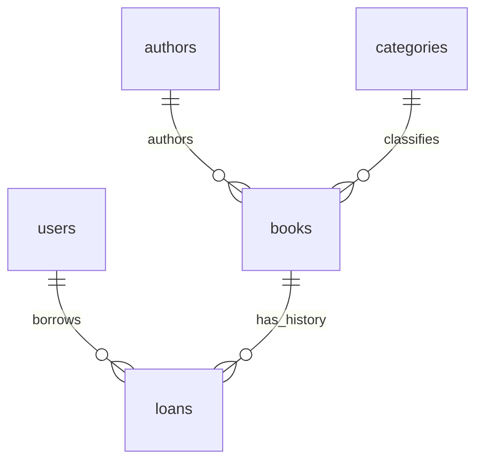
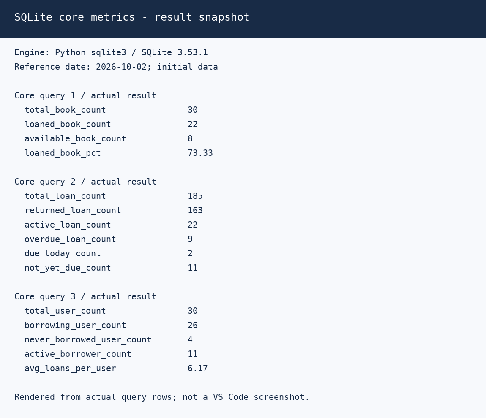
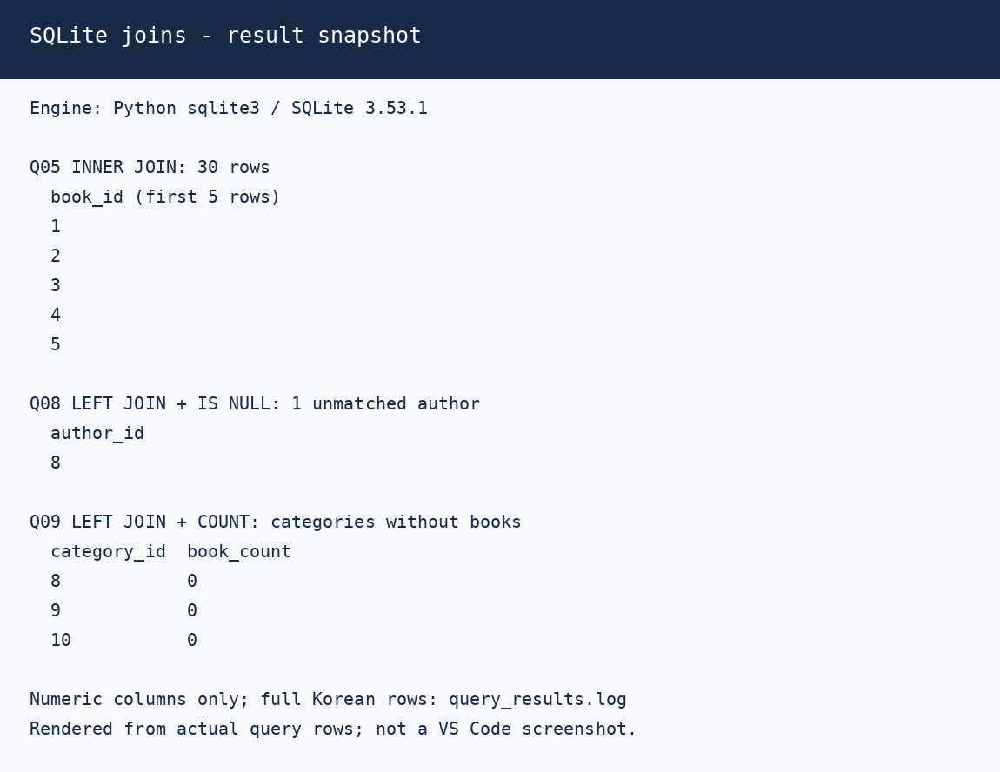

# 도서관 SQLite 학습 예제

카테고리·저자·회원·도서·대출을 설계하고 SQL 17개를 실행하는 학습 저장소입니다.
SQLite 3.37.0 이상이 필요합니다. `STRICT`와 `RETURNING`을 포함하며 사용자 환경은 3.43.2입니다.
책·저자 관계는 실제 관계, 회원·대출은 가상 데이터, 카테고리는 연습용 대표 분류입니다.

## 테이블과 초기 데이터

| 테이블 | PK | FK | 행 수 |
|---|---|---|---:|
| categories | category_id | 없음 | 10 |
| authors | author_id | 없음 | 12 |
| users | user_id | 없음 | 30 |
| books | book_id | author_id, category_id | 30 |
| loans | loan_id | user_id, book_id | 185 |

**모든 테이블은 10행 이상입니다.** 반납 완료 163건, 미반납 22건입니다.
기준일 2026-10-02와 대출일 + 14일 기한에서 연체 9건·오늘 기한 2건·기한 전 11건입니다.
`return_date`는 실제 반납일이며 `NULL`은 미반납입니다. 별도 `due_date` 열은 없습니다.
카테고리 8~10에는 책이 없어 집계 0과 평균 NULL을 확인할 수 있습니다.



**PK는 행의 식별자, FK는 다른 테이블의 행을 참조하는 연결입니다.**
도서 1번 '채식주의자'는 `author_id=1`(한강), `category_id=1`(소설)을 참조합니다.
대출 164번은 `user_id=1`(김민수), `book_id=1`(채식주의자)을 연결합니다.
회원 1번과 19번은 동명이인이므로 이름이 아닌 ID로 조인합니다.

## 파일 구성

| 파일 | 역할 |
|---|---|
| [create_table.sql](create_table.sql) | 테이블·타입·PK/FK·CHECK·인덱스와 선택 근거 |
| [insert_items.sql](insert_items.sql) | 모든 테이블의 초기 데이터 |
| [library_queries.sql](library_queries.sql) | 조회 4 + 조인 4 + 집계 3 + 서브쿼리 1 = 12개, 조회 전용 |
| [bonus/core.sql](bonus/core.sql) | 도서 가용·대출/연체·회원 이용 핵심 지표 3개 |
| [modify.sql](modify.sql) | 반납 UPDATE와 과거 이력 DELETE 2개 |
| [bonus/join_sub.sql](bonus/join_sub.sql) | LEFT JOIN/NOT EXISTS로 미이용 회원 조회 |
| [bonus/wrong_fk_insert.sql](bonus/wrong_fk_insert.sql) | 없는 카테고리 참조의 삽입 실패 예제 |
| [bonus/index_examples.sql](bonus/index_examples.sql) | 인덱스별 EXPLAIN QUERY PLAN |
| [reset_database.py](reset_database.py), [db_alias.sh](db_alias.sh) | 전체 초기화와 Bash/Zsh alias |
| [verify_submission.py](verify_submission.py) | 새 메모리 DB에서 실행·검증·로그 생성, 표준 라이브러리만 사용 |
| [docs/design.md](docs/design.md) | 정규화·타입·인덱스·NULL·단계별 집계·DB/엑셀 비교 |
| [docs/troubleshooting.md](docs/troubleshooting.md) | 실제 문제와 해결/검증 기록 |

조회 12 + 핵심 지표 3 + 수정 2 = **총 17개**입니다. 추가 bonus 예제는 별도입니다.
GitHub에는 생성 가능한 DB 바이너리를 제외하고 SQL 원본과 검증 로그를 제출합니다.

## 생성과 초기화

Python 3가 필요하며 Python 내장 SQLite도 3.37.0 이상이어야 합니다. 저장소 폴더에서 실행합니다.

```bash
python3 reset_database.py
# 같은 폴더에 library_practice.db 생성/전체 초기화

source ./db_alias.sh
dbreset
# 다른 DB: dbreset "./practice.db"
```

초기화는 **대상 DB의 모든 테이블·데이터·인덱스·뷰·트리거를 교체**합니다.
새 DB를 먼저 생성·검사한 뒤 반영하며 SQL 오류가 있으면 기존 DB를 변경하지 않습니다.
VS Code SQLite의 Open Database로 DB를 열고 필요한 쿼리만 선택해 실행합니다.
외래키 검사는 연결마다 `PRAGMA foreign_keys = ON;`으로 켭니다.
이미 데이터가 있는 DB에 seed를 다시 실행하면 PK 중복 오류가 납니다.

## 제출 결과 재현

```bash
python3 verify_submission.py
```

실제 SQLite 엔진으로 새 데이터를 만들고 17개 SQL, FK 실패·삭제 제한·갱신 전파,
미반납 중복 금지, NULL/0, 수정·삭제 및 반복 실행을 검증합니다. 사용자 DB는 바꾸지 않습니다.
이번 실행 엔진은 Python sqlite3의 **SQLite 3.53.1**이며 버전은 로그에 기록됩니다.
3.43.2에서 직접 실행한 로그라고 주장하지 않습니다.

| 제출 증거 | 내용 |
|---|---|
| [전체 17개 실행](result_log/all_query_results.log) | SQL·열 이름·실제 결과·행 수, 조회 후 수정 |
| [행 수](result_log/table_counts.log) | 모든 테이블 ≥10행 |
| [조회](result_log/query_results.log), [핵심 지표](result_log/core_query_results.log) | 초기 데이터의 실제 결과 |
| [수정·삭제](result_log/modify_results.log) | 164번 반납·1번 삭제와 두 번째 실행 0행 |
| [무결성](result_log/integrity_results.log), [잘못된 FK](result_log/wrong_fk_insert.log) | 실패 오류·CASCADE 성공·데이터 보존 |
| [중간 집계](result_log/user_loan_summary.log) | 회원별 중간 결과 30행 |
| [실행 계획](result_log/index_query_plans.log), [빈 DB](result_log/empty_database_results.log) | 인덱스와 NULL/0 경계 사례 |

이미지는 실제 실행 JSON을 렌더링한 스냅샷으로 **VS Code 화면 캡처는 아닙니다.** 한글 전체 결과는 텍스트 로그에 있습니다.





이미지 재생성은 Pillow가 있는 환경에서 `python3 tools/render_result_snapshots.py`를 실행합니다. 로그에는 Pillow가 필요하지 않습니다.

## sqlite3 CLI로 직접 로그 저장

```bash
sqlite3 -bail -echo -header -column -cmd "PRAGMA foreign_keys=ON" "library_practice.db" < "library_queries.sql" > "result_log/query_cli_results.log" 2>&1
sqlite3 -bail -echo -header -column "library_practice.db" < "bonus/core.sql" > "result_log/core_cli_results.log" 2>&1
cp "library_practice.db" "practice_run.db"
sqlite3 -bail -echo -header -column -cmd "PRAGMA foreign_keys=ON" "practice_run.db" < "modify.sql" > "result_log/modify_cli_results.log" 2>&1
```

`>`는 덮어쓰기, `>>`는 누적, `2>&1`은 오류도 저장합니다. `-bail`은 중단이며 자동 롤백은 아닙니다.
조회/core 파일은 조회만 실행합니다. modify는 복사 DB에서 실행합니다.
초기 상태에 한 번 적용하면 대출 184건·미반납 21건이 되고 두 번째 적용은 0행입니다.

## 평가 항목과 보완 위치

| 항목 | 보완 근거 |
|---|---|
| 1·7·11 | 스키마 PK/FK 목록, ER 관계, 실제 ID 예시 |
| 2 | 무결성 로그의 4개 FK 삽입 실패·4개 삭제 제한·4개 CASCADE |
| 3 | 카테고리 10행, table_counts.log |
| 4·5·12 | 전체 실행 로그와 조인 출력·스냅샷 |
| 6·8·9·10 | design.md의 정규형·타입·인덱스·DB/엑셀 비교 |
| 13·14 | SQL NULL 주석, 단계별 해설, 중간 집계·빈 DB 로그 |
| 15 | troubleshooting.md |
